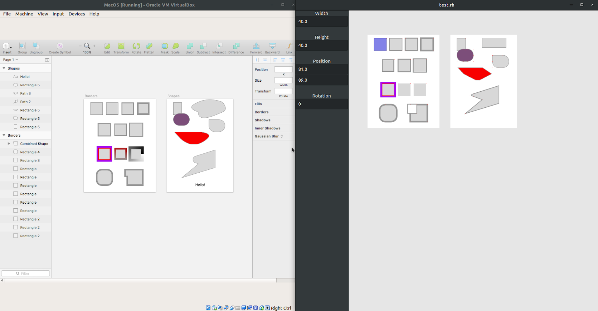

# LibreFrame

LibreFrame is a **vector design tool with a focus on high-fidelity user
interface prototyping.** It is designed to be cross-platform and can import
.sketch files.

It is currently in its early infancy, but can render many .sketch files which
don't use symbols to a recognisable degree, although many finer details will
be missing. Here's how it looks on Ubuntu 18, alongside VM-ed Sketch:

This early version is basically still a library with no application entry point.
To load the library and bootstrap & launch a basic program, execute `test.rb`
after performing a `bundle install`.